# 🔐 Lab Analyse Statique APK — UnCrackable Level 1

> **Application analysée :** OWASP MAS Crackme — Android UnCrackable Level 1  
> **Objectif :** Une chaîne de caractères secrète est dissimulée dans l'application. Trouver un moyen de l'extraire.  
> **Source APK :** https://mas.owasp.org/crackmes/Android/  
> **Hash SHA-256 :** `1DA8BF57D266109F9A07C01BF7111A1975CE01F190B9D914BCD3AE3DBEF96F21`

---

## 📁 Structure du workspace

```
C:\APK-Analysis\
├── UnCrackable-Level1.apk      ← APK analysé (66 651 octets)
├── classes.dex                 ← Bytecode extrait (supprimé après conversion)
├── decrypt.py                  ← Script de déchiffrement AES
├── hash.txt                    ← Hash SHA-256 de traçabilité
└── results\
    └── app.jar                 ← JAR converti via dex2jar (5 967 octets)
```

---

## ✅ Task 1 — Préparer le workspace et vérifier l'APK

### 1.1 Vérification de la signature ZIP (magic bytes)

```powershell
cd C:\APK-Analysis
Get-Content -Path C:\APK-Analysis\UnCrackable-Level1.apk -TotalCount 4 | Format-Hex
```

**Résultat :** Les 4 premiers octets affichent `50 4B 03 04` → signature **"PK"** confirmée ✅

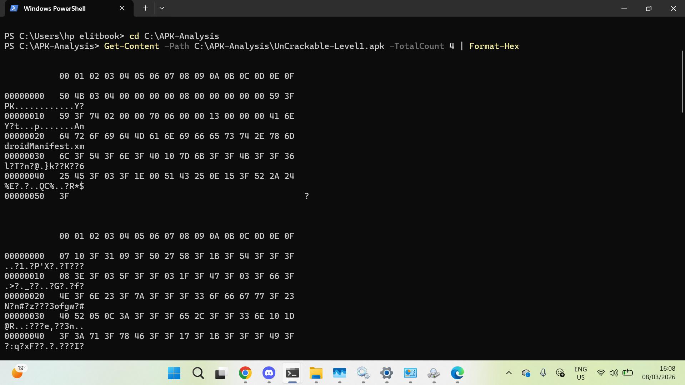

---

### 1.2 Listage du contenu de l'APK

```powershell
Add-Type -Assembly System.IO.Compression.FileSystem
$apk = "C:\APK-Analysis\UnCrackable-Level1.apk"
[System.IO.Compression.ZipFile]::OpenRead($apk).Entries | Select-Object -ExpandProperty FullName -First 20
```

**Contenu identifié :**
- `AndroidManifest.xml` — manifeste de l'application
- `classes.dex` — bytecode compilé
- `resources.arsc` — ressources compilées
- `META-INF/` — certificats de signature
- `res/layout/activity_main.xml` — layout principal

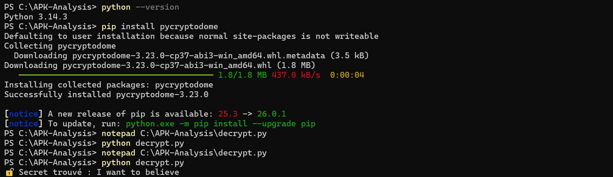

---

### 1.3 Hash SHA-256

```powershell
Get-FileHash -Algorithm SHA256 C:\APK-Analysis\UnCrackable-Level1.apk
```

| Algorithme | Hash |
|---|---|
| SHA256 | `1DA8BF57D266109F9A07C01BF7111A1975CE01F190B9D914BCD3AE3DBEF96F21` |

---

## ✅ Task 2 — Obtenir l'APK

APK téléchargé directement depuis le site officiel OWASP MAS.

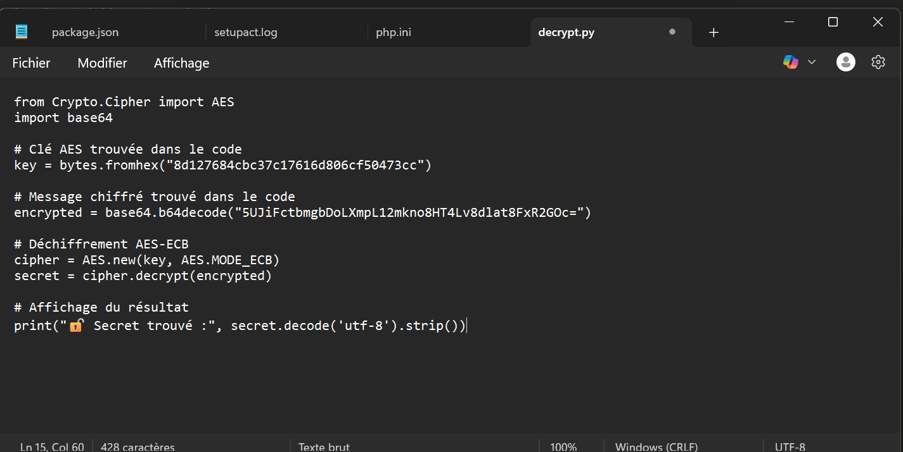

- **Source :** https://mas.owasp.org/crackmes/Android/
- **Taille :** 66 651 octets (65,1 Ko)
- **Provenance :** Officielle OWASP — challenge pédagogique

---

## ✅ Task 3 — Analyse avec JADX GUI

**Outil :** JADX v1.5.5  
**Chemin :** `C:\Users\hp elitbook\Downloads\jadx-1.5.5\bin\jadx-gui.bat`

### 3.1 Ouverture de l'APK dans JADX GUI

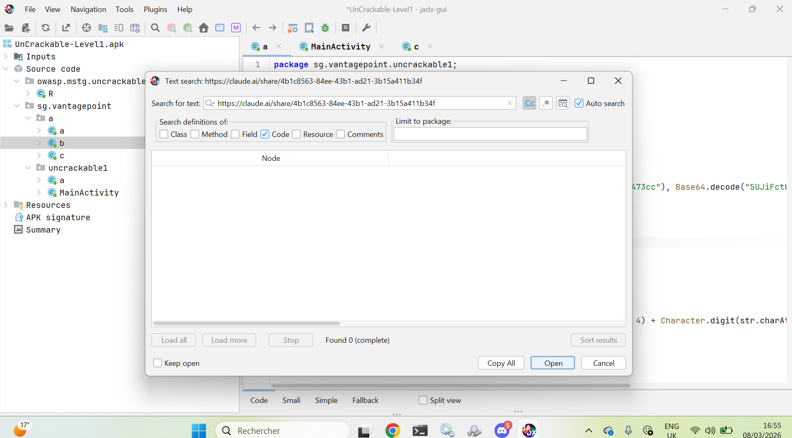

**Informations générales identifiées :**

| Champ | Valeur |
|---|---|
| Package principal | `sg.vantagepoint.uncrackable1` |
| Classe principale | `MainActivity` |
| Package helper | `sg.vantagepoint.a` (classes a, b, c) |

---

### 3.2 Analyse de MainActivity — onCreate()

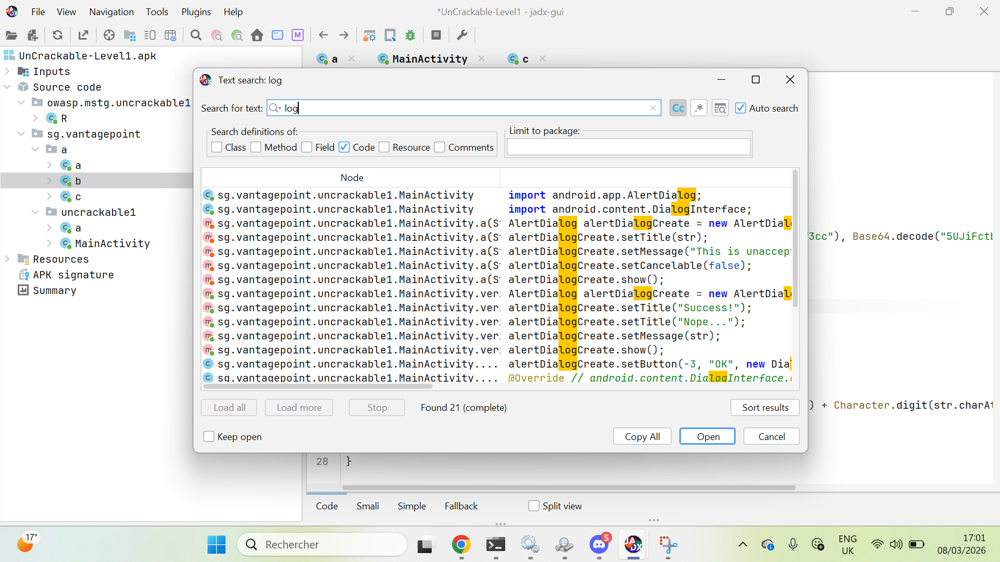

**Éléments critiques identifiés dans `onCreate()` :**

```java
if (c.a() || c.b() || c.c()) {
    a("Root detected!");         // ← Détection de root (3 méthodes)
}
if (b.a(getApplicationContext())) {
    a("App is debuggable!");     // ← Détection du flag debuggable
}
```

➡️ L'application vérifie si l'appareil est **rooté** et si l'app est **déboguable** au démarrage.

---

### 3.3 Découverte du secret chiffré — Classe `sg.vantagepoint.a.b`

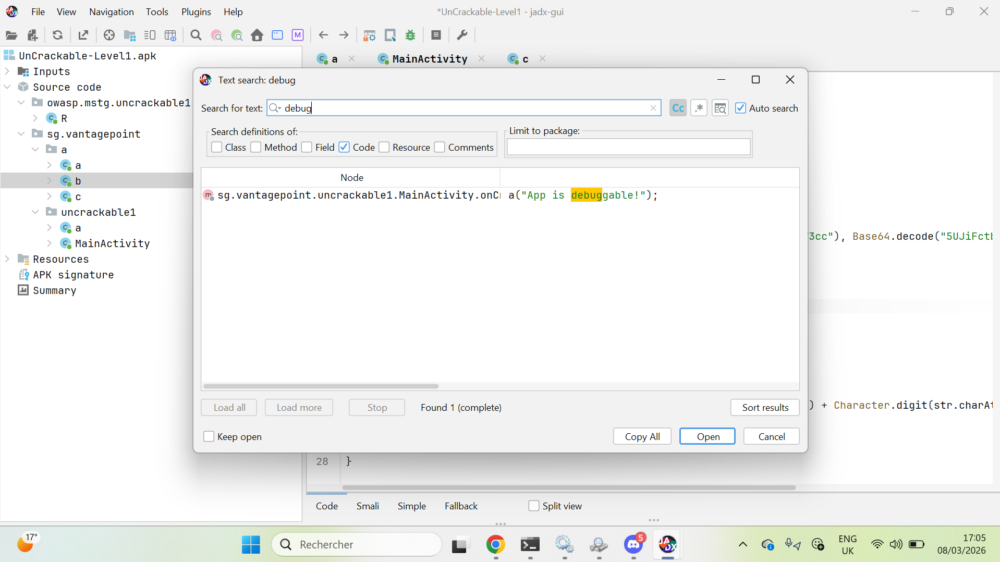

**🔑 Découverte majeure :** La clé AES et le message chiffré sont codés en dur dans le code !

```java
// Ligne 12 — Classe sg.vantagepoint.a.b
bArrA = sg.vantagepoint.a.a.a(
    b("8d127684cbc37c17616d806cf50473cc"),   // ← Clé AES en hexadécimal
    Base64.decode("5UJiFctbmgbDoLXmpL12mkno8HT4Lv8dlat8FxR2GOc=")  // ← Message chiffré Base64
);
return str.equals(new String(bArrA));
```

| Élément | Valeur |
|---|---|
| Clé AES (hex) | `8d127684cbc37c17616d806cf50473cc` |
| Message chiffré (Base64) | `5UJiFctbmgbDoLXmpL12mkno8HT4Lv8dlat8FxR2GOc=` |
| Mode de chiffrement | AES-ECB |

---

### 3.4 Recherche de chaînes sensibles — "debug"

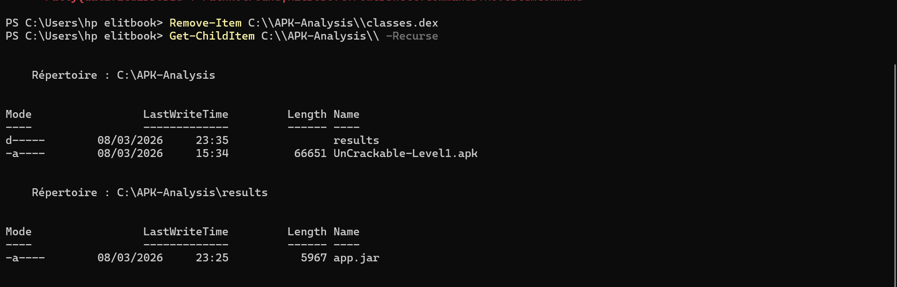

**Résultat :** 1 occurrence trouvée → `a("App is debuggable!")` dans `MainActivity.onCreate()`

---

### 3.5 Recherche de chaînes sensibles — "log"

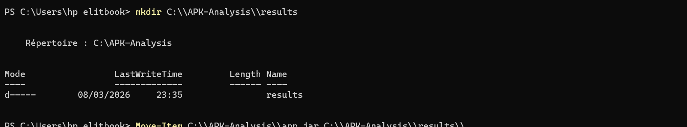

**Résultat :** 21 occurrences trouvées — principalement liées à `AlertDialog` (faux positifs) et `Log.d("CodeCheck", "AES error:")` dans la classe `b`.

---

## ✅ Task 4 — Recherche de chaînes sensibles

### Résumé des recherches effectuées

| Pattern recherché | Résultats | Pertinence |
|---|---|---|
| `debug` | 1 | ✅ Élevée — flag debuggable détecté |
| `log` | 21 | ⚠️ Moyenne — AES error log trouvé |
| `Base64` | Présent | ✅ Élevée — données chiffrées |
| `AES` | Présent | ✅ Élevée — chiffrement symétrique |
| `http://` | 0 | ✅ RAS |
| `password` | 0 | ✅ RAS |
| `Root detected` | 1 | ⚠️ Moyenne — logique de détection |

---

## ✅ Task 5 — Conversion DEX → JAR avec dex2jar

### 5.1 Extraction du fichier DEX

```powershell
Add-Type -Assembly System.IO.Compression.FileSystem
$zip = [System.IO.Compression.ZipFile]::OpenRead("C:\APK-Analysis\UnCrackable-Level1.apk")
$dex = $zip.Entries | Where-Object { $_.Name -like "classes*.dex" }
$dex | ForEach-Object {
    [System.IO.Compression.ZipFileExtensions]::ExtractToFile($_, "C:\APK-Analysis\$($_.Name)", $true)
}
$zip.Dispose()
```


---

### 5.2 Conversion DEX → JAR

```powershell
cd "C:\Users\hp elitbook\Downloads\dex-tools-v2.4\dex-tools-v2.4"
.\d2j-dex2jar.bat "C:\APK-Analysis\classes.dex" -o "C:\APK-Analysis\app.jar"
```

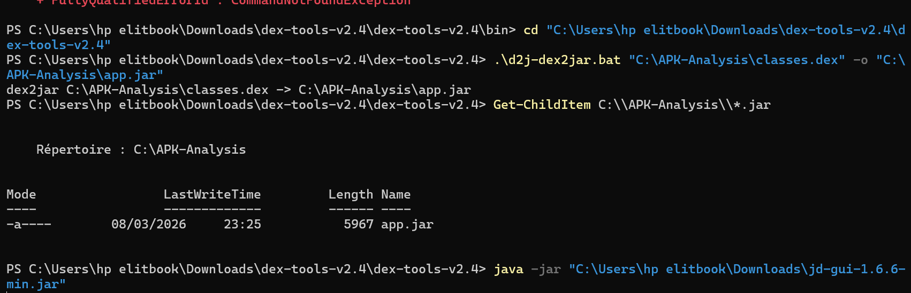

**Résultat :**
```
dex2jar C:\APK-Analysis\classes.dex -> C:\APK-Analysis\app.jar
```

Fichier généré : `app.jar` (5 967 octets) ✅

---

## ✅ Task 6 — Comparaison JADX vs JD-GUI

### 6.1 JD-GUI — Ouverture du JAR

```powershell
java -jar "C:\Users\hp elitbook\Downloads\jd-gui-1.6.6-min.jar"
```

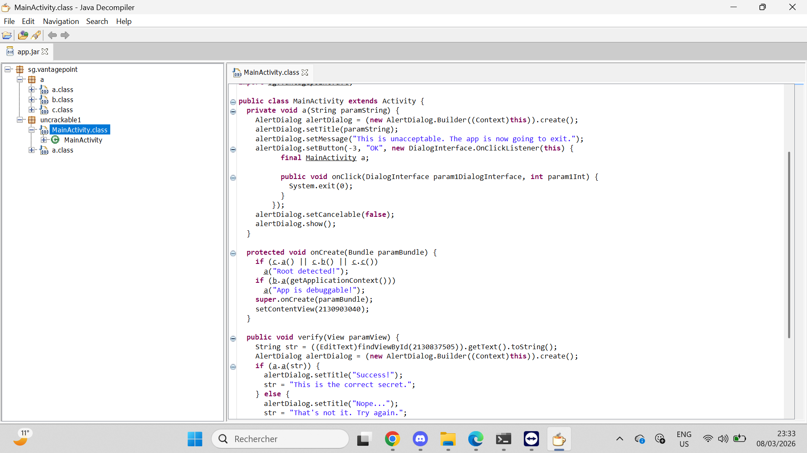

### 6.2 Tableau comparatif

| Aspect | JADX GUI | JD-GUI |
|---|---|---|
| **Navigation** | Structure Android complète (manifest, ressources, code) | Structure Java uniquement (packages, classes) |
| **Lisibilité** | Noms de variables reconstruits, meilleure lisibilité | Noms partiellement obfusqués conservés |
| **Ressources** | Accès direct à `AndroidManifest.xml`, `strings.xml` | Pas d'accès aux ressources Android |
| **Recherche** | Recherche globale dans tout l'APK | Recherche limitée au code Java |
| **Kotlin** | Bonne gestion du code Kotlin | Difficultés avec la syntaxe Kotlin |
| **Annotations Android** | Préservées | Parfois perdues |

**Conclusion :** JADX GUI est nettement supérieur pour l'analyse d'APK Android. JD-GUI reste utile comme outil complémentaire pour une seconde lecture du bytecode Java.

---

## 🔓 Bonus — Déchiffrement du secret (AES-ECB)

### Script Python `decrypt.py`

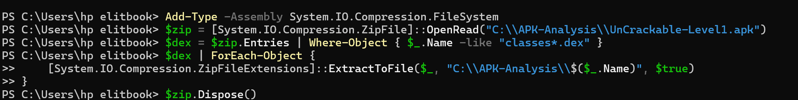

```python
from Crypto.Cipher import AES
import base64

# Clé AES trouvée dans le code
key = bytes.fromhex("8d127684cbc37c17616d806cf50473cc")

# Message chiffré trouvé dans le code
encrypted = base64.b64decode("5UJiFctbmgbDoLXmpL12mkno8HT4Lv8dlat8FxR2GOc=")

# Déchiffrement AES-ECB
cipher = AES.new(key, AES.MODE_ECB)
secret = cipher.decrypt(encrypted)

print("🔓 Secret trouvé :", secret.decode('utf-8').strip())
```

### Exécution

```powershell
pip install pycryptodome
python decrypt.py
```

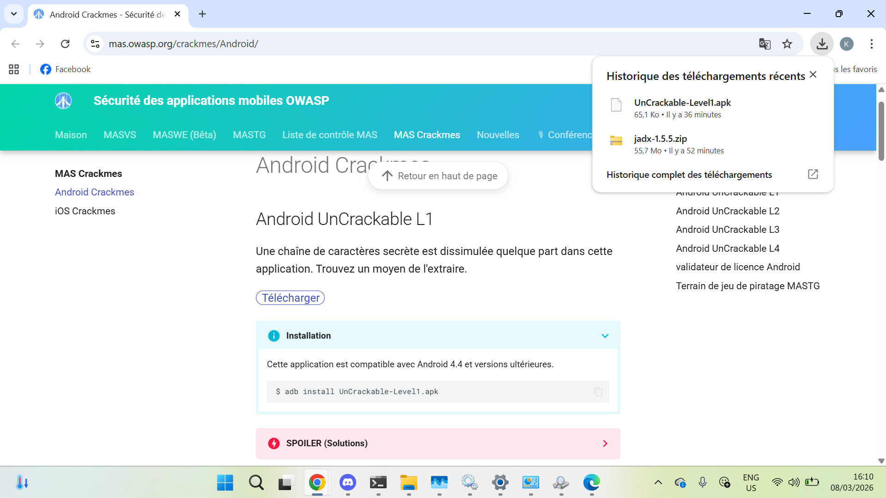

**🎯 Résultat :**
```
🔓 Secret trouvé : I want to believe
```

---

## ✅ Task 7 — Constats de sécurité

### Constat #1 — Clé AES codée en dur
| | |
|---|---|
| **Sévérité** | 🔴 Élevée |
| **Description** | La clé AES (`8d127684cbc37c17616d806cf50473cc`) et le message chiffré sont stockés directement dans le bytecode, récupérables par simple décompilation |
| **Localisation** | `sg.vantagepoint.a.b` — méthode `a(String str)` ligne 12 |
| **Impact** | Compromission complète du secret sans exécution de l'application |
| **Remédiation** | Vérification côté serveur uniquement, jamais stocker de secret dans l'APK |

---

### Constat #2 — Application déboguable
| | |
|---|---|
| **Sévérité** | 🔴 Élevée |
| **Description** | L'application détecte elle-même qu'elle est déboguable (`b.a(getApplicationContext())`) ce qui confirme que `android:debuggable=true` est actif |
| **Localisation** | `sg.vantagepoint.uncrackable1.MainActivity` — `onCreate()` ligne 34 |
| **Impact** | Attachement d'un débogueur ADB possible, bypass des contrôles de sécurité |
| **Remédiation** | Désactiver `android:debuggable` en production, automatiser via la config de build release |

---

### Constat #3 — Détection de root contournable
| | |
|---|---|
| **Sévérité** | 🟠 Moyenne |
| **Description** | 3 méthodes de détection de root (`c.a()`, `c.b()`, `c.c()`) basiques, facilement bypassables via Frida ou Magisk Hide |
| **Localisation** | `sg.vantagepoint.a.c` — méthodes a(), b(), c() |
| **Impact** | Un appareil rooté avec Magisk peut contourner la détection et accéder à l'application |
| **Remédiation** | Utiliser Play Integrity API, détecter les hooks Frida, vérifications multi-couches |

---

### Constat #4 — Utilisation d'AES en mode ECB
| | |
|---|---|
| **Sévérité** | 🟠 Moyenne |
| **Description** | Le mode AES-ECB est utilisé pour chiffrer le secret. Ce mode ne garantit pas la confidentialité pour des données structurées |
| **Localisation** | `sg.vantagepoint.a.a` — méthode `a()` |
| **Impact** | Vulnérabilité cryptographique structurelle (attaques par blocs identiques) |
| **Remédiation** | Utiliser AES-GCM ou AES-CBC avec IV aléatoire |

---

## ✅ Task 8 — Nettoyage

```powershell
# Organisation des fichiers finaux
mkdir C:\APK-Analysis\results
Move-Item C:\APK-Analysis\app.jar C:\APK-Analysis\results\

# Suppression des artefacts temporaires
Remove-Item C:\APK-Analysis\classes.dex
```

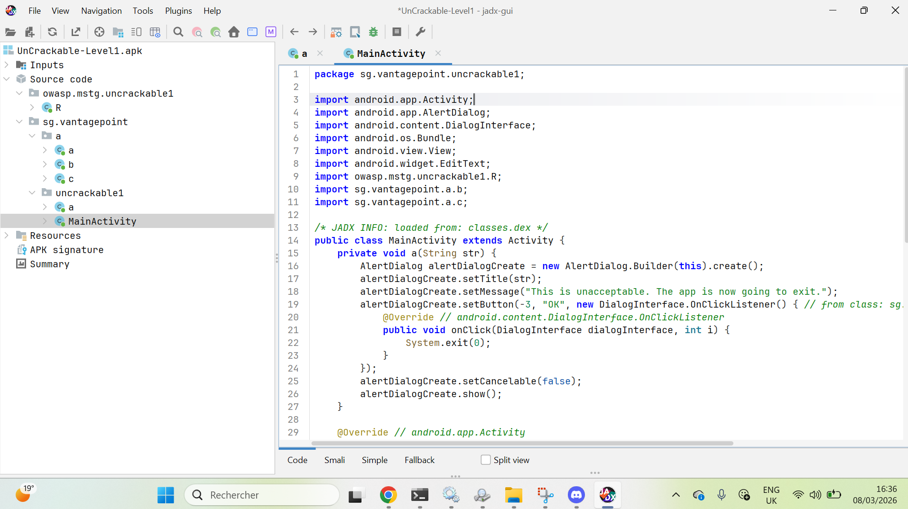

**Structure finale :**

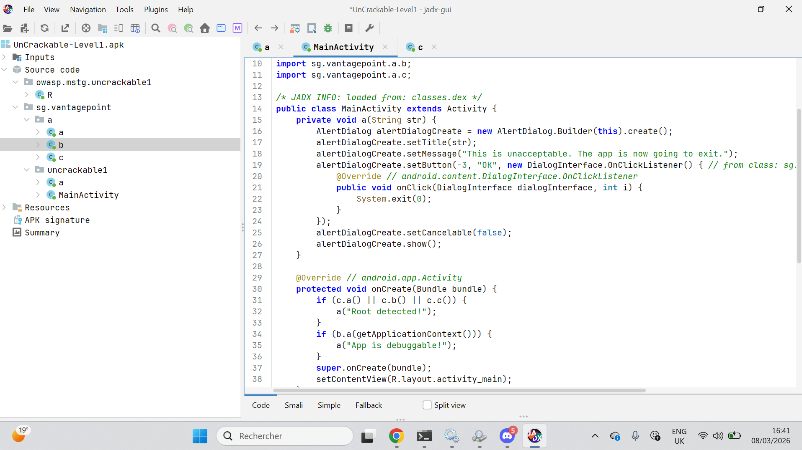

```
C:\APK-Analysis\
├── UnCrackable-Level1.apk   ← 66 651 octets
└── results\
    └── app.jar              ← 5 967 octets
```

---

## 📊 Récapitulatif

| Task | Statut | Points clés |
|---|---|---|
| Task 1 — Workspace | ✅ | APK vérifié (PK magic bytes), SHA-256 noté |
| Task 2 — Obtenir l'APK | ✅ | Source officielle OWASP MAS |
| Task 3 — JADX GUI | ✅ | Manifeste analysé, code décompilé |
| Task 4 — Chaînes sensibles | ✅ | Clé AES + Base64 trouvées |
| Task 5 — DEX → JAR | ✅ | app.jar généré (dex2jar v2.4) |
| Task 6 — JADX vs JD-GUI | ✅ | 6 différences documentées |
| Task 7 — Rapport | ✅ | 4 constats documentés |
| Task 8 — Nettoyage | ✅ | Workspace organisé |

---

> 📌 **Document réalisé à des fins pédagogiques uniquement.**  
> L'application UnCrackable Level 1 est un challenge officiel OWASP MAS conçu pour l'apprentissage de la sécurité mobile.
