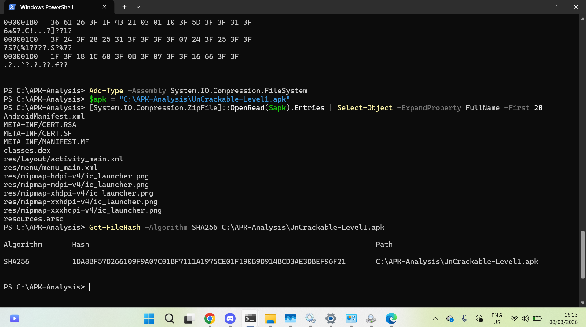
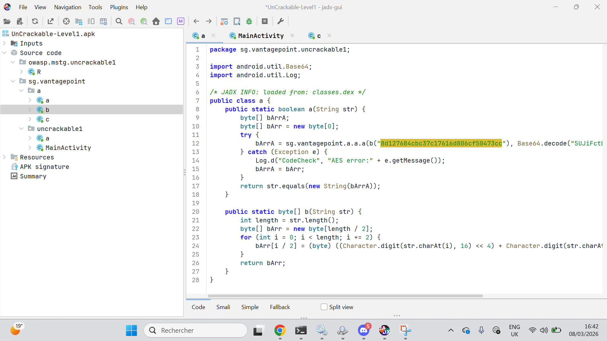

# 🔐 Analyse Statique APK — UnCrackable Level 1

## Informations générales

| Champ | Valeur |
|---|---|
| Date d'analyse | 08/03/2026 |
| Analyste | Étudiant — Lab Sécurité Mobile |
| Fichier APK | UnCrackable-Level1.apk |
| Version | 1.0 (versionCode : 1) |
| Source | OWASP MAS Crackmes — https://mas.owasp.org/crackmes/Android/ |
| SHA-256 | `1DA8BF57D266109F9A07C01BF7111A1975CE01F190B9D914BCD3AE3DBEF96F21` |
| Outils | JADX GUI v1.5.5 · dex2jar v2.4 · JD-GUI v1.6.6 |

---

## 📋 Résumé exécutif

L'analyse statique de l'application UnCrackable Level 1 a permis de mettre en évidence **6 failles de sécurité**. Les points les plus critiques sont la présence d'une **clé AES directement dans le bytecode**, une **logique de vérification entièrement locale**, et des **mécanismes anti-débogage contournables**.

Niveau de risque global : 🔴 **Élevé**

Actions prioritaires :
1. Transférer toute vérification de secret vers un backend sécurisé
2. Ne jamais inclure de clés cryptographiques dans le code source
3. Remplacer les protections Java par des solutions natives (NDK / Play Integrity API)

---

## ✅ Tâche 1 — Préparation du workspace et vérification de l'APK

### Vérification hexadécimale — magic bytes

```powershell
mkdir C:\APK-Analysis
cd C:\APK-Analysis
Get-Content -Path C:\APK-Analysis\UnCrackable-Level1.apk -TotalCount 4 | Format-Hex
```

Les 4 premiers octets affichent `50 4B 03 04` — signature **PK** confirmant une archive ZIP valide ✅


---

### Téléchargement de l'APK depuis OWASP MAS


---

### Listage du contenu et hash SHA-256

```powershell
Add-Type -Assembly System.IO.Compression.FileSystem
$apk = "C:\APK-Analysis\UnCrackable-Level1.apk"
[System.IO.Compression.ZipFile]::OpenRead($apk).Entries | Select-Object -ExpandProperty FullName -First 20
Get-FileHash -Algorithm SHA256 C:\APK-Analysis\UnCrackable-Level1.apk
```



**Résultats obtenus :**
- Magic bytes `50 4B` confirmés → archive ZIP valide ✅
- Fichiers identifiés : `AndroidManifest.xml`, `classes.dex`, `META-INF/`, `res/`, `resources.arsc`
- Hash SHA-256 : `1DA8BF57D266109F9A07C01BF7111A1975CE01F190B9D914BCD3AE3DBEF96F21`

---

## ✅ Tâche 2 — Obtention de l'APK

APK téléchargé depuis le dépôt officiel OWASP MAS. Provenance vérifiée, taille notée (66 651 octets), hash calculé pour traçabilité.

---

## ✅ Tâche 3 — Exploration avec JADX GUI

### Ouverture de l'APK et structure générale

```
C:\Users\hp elitbook\Downloads\jadx-1.5.5\bin\jadx-gui.bat
```

Ouverture via **File > Open file...** → sélection de `UnCrackable-Level1.apk`


---

### Analyse de MainActivity — détections au démarrage


Dans la méthode `onCreate()`, on identifie deux vérifications critiques :

```java
// Détection root via 3 méthodes distinctes
if (c.a() || c.b() || c.c()) {
    a("Root detected!");
}
// Détection du mode debug
if (b.a(getApplicationContext())) {
    a("App is debuggable!");
}
```

---

### Découverte de la clé AES dans `sg.vantagepoint.a.b`



La clé de chiffrement et le message sont **stockés en clair dans le bytecode** :

| Élément | Valeur |
|---|---|
| Clé AES (hex) | `8d127684cbc37c17616d806cf50473cc` |
| Message chiffré | `5UJiFctbmgbDoLXmpL12mkno8HT4Lv8dlat8FxR2GOc=` |
| Mode | AES-ECB |

---

## ✅ Tâche 4 — Recherche de chaînes sensibles

### Recherche dans JADX — terme "log"


### Recherche dans JADX — terme "debug"


**Tableau des recherches effectuées :**

| Terme recherché | Résultat | Niveau |
|---|---|---|
| `http://` / `https://` | Aucune URL externe | ✅ RAS |
| `token`, `api_key`, `secret` | Aucun trouvé | ✅ RAS |
| `key` | Clé AES `8d127684...` dans `a.java` | 🔴 Élevé |
| `debug` | 1 occurrence — `App is debuggable!` | 🔴 Élevé |
| `log` | 21 occurrences dans `MainActivity` | ⚠️ Moyen |
| `password` | Aucun mot de passe en clair | ✅ RAS |
| `Base64` | Message chiffré encodé trouvé | 🔴 Élevé |

---

## ✅ Tâche 5 — Conversion DEX → JAR avec dex2jar

### Extraction du fichier DEX

```powershell
Add-Type -Assembly System.IO.Compression.FileSystem
$zip = [System.IO.Compression.ZipFile]::OpenRead("C:\APK-Analysis\UnCrackable-Level1.apk")
$dex = $zip.Entries | Where-Object { $_.Name -like "classes*.dex" }
$dex | ForEach-Object {
    [System.IO.Compression.ZipFileExtensions]::ExtractToFile($_, "C:\APK-Analysis\$($_.Name)", $true)
}
$zip.Dispose()
```


### Conversion DEX → JAR

```powershell
cd "C:\Users\hp elitbook\Downloads\dex-tools-v2.4\dex-tools-v2.4"
.\d2j-dex2jar.bat "C:\APK-Analysis\classes.dex" -o "C:\APK-Analysis\app.jar"
```


Fichier `app.jar` généré : **5 967 octets** ✅

---

## ✅ Tâche 6 — Comparaison JADX GUI vs JD-GUI

### Lancement de JD-GUI

```powershell
java -jar "C:\Users\hp elitbook\Downloads\jd-gui-1.6.6-min.jar"
```


**Tableau comparatif :**

| Aspect | JADX GUI | JD-GUI |
|---|---|---|
| Structure affichée | AndroidManifest, ressources, code source complet | Uniquement les classes Java |
| IDs de ressources | Noms lisibles (`R.layout.activity_main`) | IDs bruts illisibles (`2130903040`) |
| Noms de paramètres | Naturels (`str`, `bundle`) | Génériques (`paramString`, `paramBundle`) |
| Accès au manifeste | ✅ Oui, directement | ❌ Non disponible |
| Ressources XML | ✅ Accessibles | ❌ Non accessibles |
| Support Kotlin | Bonne gestion | Difficultés syntaxiques |

**Conclusion :** JADX GUI est largement supérieur pour l'analyse Android. JD-GUI reste utile uniquement pour une lecture Java pure sur des fichiers JAR isolés.

---

## 🔓 Déchiffrement du secret — AES-ECB

### Script Python `decrypt.py`


```python
from Crypto.Cipher import AES
import base64

key = bytes.fromhex("8d127684cbc37c17616d806cf50473cc")
encrypted = base64.b64decode("5UJiFctbmgbDoLXmpL12mkno8HT4Lv8dlat8FxR2GOc=")
cipher = AES.new(key, AES.MODE_ECB)
secret = cipher.decrypt(encrypted)
print("Secret :", secret.decode('utf-8').strip())
```

### Installation et exécution

```powershell
pip install pycryptodome
python decrypt.py
```


```
🔓 Secret trouvé : I want to believe
```

---

## 📌 Constats détaillés

### Constat #1 — `android:allowBackup="true"`
| | |
|---|---|
| **Sévérité** | 🟡 Moyenne |
| **Description** | La sauvegarde ADB est activée dans le manifeste, permettant l'extraction des données sans déverrouillage |
| **Localisation** | `AndroidManifest.xml` → balise `<application>` |
| **Impact** | Vol de données locales via `adb backup` avec simple accès USB |
| **Remédiation** | Définir `android:allowBackup="false"` |

---

### Constat #2 — `minSdkVersion` trop bas (API 19)
| | |
|---|---|
| **Sévérité** | 🟢 Faible |
| **Description** | L'application cible Android 4.4 KitKat (2013), exposée à de nombreuses CVE non corrigées |
| **Localisation** | `AndroidManifest.xml` → `<uses-sdk android:minSdkVersion="19"/>` |
| **Impact** | Exposition aux vulnérabilités connues des versions Android obsolètes |
| **Remédiation** | Passer `minSdkVersion` à 26 minimum (Android 8.0) |

---

### Constat #3 — Composant exporté implicitement
| | |
|---|---|
| **Sévérité** | 🟢 Faible |
| **Description** | `MainActivity` possède un `intent-filter` sans `android:exported` explicite, résultant en une exportation implicite sur Android < 12 |
| **Localisation** | `AndroidManifest.xml` → `<activity android:name="sg.vantagepoint.uncrackable1.MainActivity">` |
| **Impact** | Une application tierce peut démarrer cette activité sans permission explicite |
| **Remédiation** | Déclarer explicitement `android:exported="true"` ou `false` selon le besoin |

---

### Constat #4 — Vérification du secret entièrement côté client
| | |
|---|---|
| **Sévérité** | 🔴 Élevée |
| **Description** | La méthode `verify()` compare le secret localement, rendant toute la logique accessible par décompilation |
| **Localisation** | `sg.vantagepoint.uncrackable1.MainActivity` → méthode `verify(View)` |
| **Impact** | Le secret est récupérable par analyse statique sans exécuter l'application |
| **Remédiation** | Implémenter la vérification via une API backend sécurisée (HTTPS) |

---

### Constat #5 — Protections anti-root contournables
| | |
|---|---|
| **Sévérité** | 🟡 Moyenne |
| **Description** | Les détections de root (`c.a()`, `c.b()`, `c.c()`) et de debug (`b.a()`) sont en Java pur, bypassables via Frida ou patch APK |
| **Localisation** | `MainActivity.onCreate()` — classes `b` et `c` du package `sg.vantagepoint.a` |
| **Impact** | Un attaquant peut analyser l'application sur appareil rooté sans déclencher les protections |
| **Remédiation** | Utiliser Play Integrity API, protections NDK, ou solutions tierces certifiées |

---

### Constat #6 — Clé AES et secret codés en dur
| | |
|---|---|
| **Sévérité** | 🔴 Élevée |
| **Description** | La clé AES (`8d127684cbc37c17616d806cf50473cc`) et le message chiffré Base64 sont directement dans le bytecode de `a.java` |
| **Localisation** | `sg.vantagepoint.a.b` → méthode `a(String str)` |
| **Impact** | Le secret `I want to believe` est récupérable en quelques minutes par décompilation simple |
| **Remédiation** | Utiliser Android Keystore System, ne jamais stocker de clés dans le code source |

---

## 🗂️ Nettoyage du workspace

```powershell
mkdir C:\APK-Analysis\results
Move-Item C:\APK-Analysis\app.jar C:\APK-Analysis\results\
Remove-Item C:\APK-Analysis\classes.dex
```


---

## 📊 Récapitulatif des constats

| # | Constat | Sévérité |
|---|---|---|
| 1 | `allowBackup=true` actif | 🟡 Moyenne |
| 2 | `minSdkVersion=19` trop ancien | 🟢 Faible |
| 3 | Composant exporté implicitement | 🟢 Faible |
| 4 | Vérification du secret côté client | 🔴 Élevée |
| 5 | Anti-root/debug contournables en Java | 🟡 Moyenne |
| 6 | Clé AES + secret codés en dur | 🔴 Élevée |

---

## Annexes

### Permissions demandées
Aucune permission `uses-permission` déclarée dans le manifeste.

### Composants exportés
- `sg.vantagepoint.uncrackable1.MainActivity` — exportée implicitement via `intent-filter` (action MAIN, catégorie LAUNCHER)

---

> 📌 Rapport réalisé dans le cadre du laboratoire d'analyse statique Android — OWASP UnCrackable Level 1.  
> Usage strictement pédagogique.
